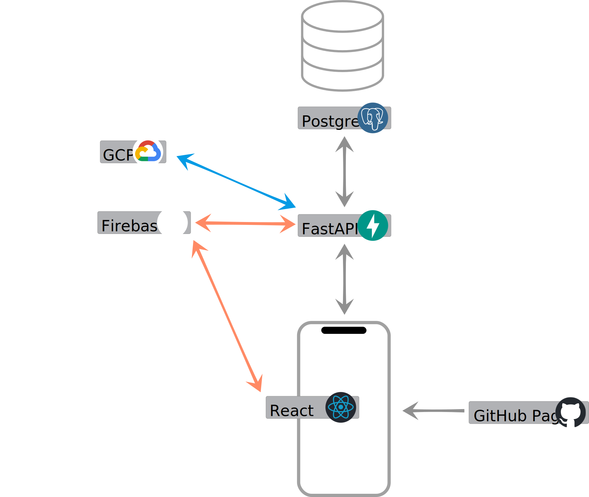
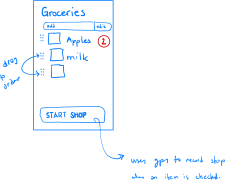
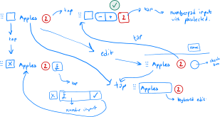
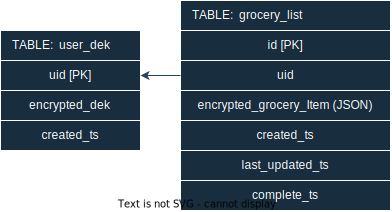

# Groceries

🚧 The services under the project are currently private repositories, but you can raise issues against this repo so I can triage them. 🚧

| Services	|   Deployment   |
| :---	    |   :---         |
| **[frontend](https://github.com/BhawickJain/groceries-fe)**     | [`frontend/prod`](https://bhawickjain.github.io/groceries-fe/)
| **[backend](https://github.com/BhawickJain/groceries-api)**     | [`api/prod/docs`](https://groceries-api-prod.up.railway.app/docs)

A full-stack app that allows you to track your grocery shopping. This repository holds the `docker-compose` setup to spin up the local development environment.

>__In development 👷🏾__
>
>The project is currently under development, and the services powering the app are currently private repositories. You can however visit the [CONTRIBUTING.md](./CONTRIBUTING.md) article to see how I use Docker containers and Git Submodules to make development easier to setup and reproducible.

## Overview

__App Architectural Diagram__

The web app is hosted on GitHub Pages and communicates to the FastAPI backend to fetch user data. The app state is saved in the client's local storage for faster load times. Firebase is used for all user authentication actions, including verification of a user id JWT token in the backend. Google Cloud Platform's Key Management Service (KMS) is used to encrypt client Data Encryption Keys. More on that in [Client-Side Encryption Strategy]().

__User ID Authorisation JWT with each request__

The diagram below describes how, once the user is logged in and authenticated by firebase, each request must use a JWT token to prove its identification to the grocery api to make an authorised request.

### Frontend

       

The frontend is written in Typescript and uses vite-react as its framework to generate a static site. This is hosted on github pages on a HTTPS domain. The UI currently uses Chakra, but that may change in the near future. The app state is managed using Redux.

#### UI Wireframe

The drawings below are rough sketches of my UI ideas when planning the grocery app. It is very rough, and as the UX approach matures, I will have clearer mock ups.

Essentially, a user can add items, change the quantity & order, and check them off with one hand going for a grocery shop. The checked off items don't disappear to help the user verify their basket when ending their shop.

The main functionality I am aiming for (i.e. not implemented) is to allow a user to add their preferred store against a grocery item. This, together with a live GPS position, will allow the app to rearrange or filter items when inside their preferred store. 

__Shop mode__

Shop mode is likely the main way to enable the GPS tracking. The user will start their shop and the app will reveal only the items needed at the store.

__UI interaction workflow in shop mode__

Below are some workflows on how the user can add and edit their grocery items. Ideally the grocery item is a shared entity in a database which many users can contribute and refer to in their list. There are some notes on submitting the price of an item to track spending.

### Backend
     

The grocery api is written in python and uses the FastAPI framework. I also use SQLAlchemy to communicate with the postgres database. The api and the database is deployed on [railway.app](https://railway.app).

#### Database Design

The diagram below shows the smallest possible database footprint to get the grocery app proof-of-concept working. 

The `grocery_list` table holds a list of encrypted grocery items and some metadata on whether it has been completed, updated and when it was created. All user items are stored here. 

The `user_dek` holds a record of user registration and their encrypted data encryption key. The data encryption key is the web-app's auto generated key which is used to encrypt the user's personal list. More information in the next section.

### Client-Side Encryption Strategy

> ️️🚨️ This is a small dabble with security, and I wouldn't consider the strategy secure. I just wanted to try the concept out.

The purpose of the strategy is to have user grocery items be encrypted at rest in the database. I didn't want the api to see the data either, so each client sends their data in an encrypted form.

The client device is responsible for generating a Data Encryption Key (DEK) and use it to encrypt any items that goes to the api. The DEK uses the symmetric AES-256 scheme, as only one and the same user generates and consumes the data. The DEK must be stored securely because if lost, the client will not be able to recover their items. In addition, it needs to be shared to any device the client is logged into. To make that possible, the DEK must be encrypted and saved in the database with the api's own encryption key, called the Key Encrypted Key (KEK). 

> Another approach maybe that the devices exchanges the keys through web sockets or a QR code which would avoid storing the DEK externally. This would mean, however, that the user must have both devices present or are at least online and logged in. The risk of losing the DEK still remains as local storage could be cleared without notice.

Google Cloud Platform Key Management Service (GCP KMS) is used to generate and encrypt the DEK. Because of the way GCP KMS works, the api can never see the key used to encrypt the DEK. Both railway, GCP and firebase are registered with different user accounts to make sure no one account has too much oversight.

> Ideally the Data Encryption Key (DEK) would not be stored, even if encrypted, on the database. The current approach allows a registered user to access their items from any device as the DEK is shared to that device upon successful login. Another approach would be to make the user responsible which could be an option that is made available to the user.

The diagram below describes how user registration and data encryption works. All communication between github, web app and the FastAPI is `HTTPS` and considered secure. I am also assuming the client device and railway production environment is secure. 

When a user logs in, the web-app requests the user's Data Encryption Key (DEK) from the api. If the user is not registered, the client generates a DEK on device, and makes a `register` request to the api with the DEK. This is encrypted with GCP KMS and stored by the api in the `user_dek` database table. Once registered, the web-app requests the DEK to double check the key is saved correctly.

## Features
- [x] add groceries to a checklist
- [x] add quantities for each grocery item
- [x] reorder groceries to your liking
- [ ] enter grocery stores you go to
- [ ] edit a grocery item
